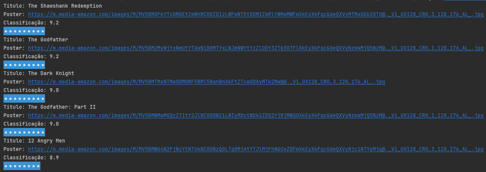

## **Projeto Aula 1 - Imersão Java Alura**

### Projeto desenvolvido para aprendizado da linguagem de programação Java, durante a Imersão Java da Alura.

## 🛠️ Funcionalidades do projeto

- `Funcionalidade 1`: Acessar API de filmes do IMDB
- `Funcionalidade 2`: Exibir os dados da lista de melhores filmes da platadorma, link para seu poster e sua classificação

## 📁 Acesso ao projeto

- Baixe ou clone o projeto;
- Abra a pasta src e depois o arquivo "App.java";

  `Caso tenha interesse, a URL pode ser alterada para a plataforma de sua preferência, basta abrir a plataforma desejada realizar ocadastro e utilizar sua API de acesso.`

## 🛠️ Abrir e rodar o projeto

- Basta executar o código e gerar sua lista de filmes.